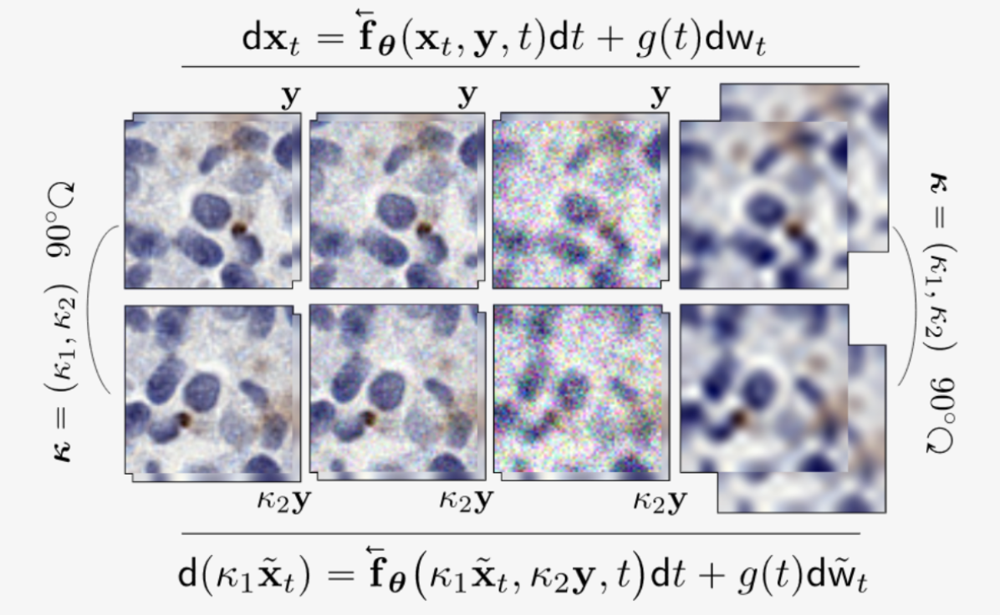

# Diffusion Models under Group Transformations

Official Implementation of [Diffusion Models under Group Transformations](https://openreview.net/forum?id=TxYNVSoAz4).

<p align="center">
  
</p>

## Abstract
In recent years, diffusion models have become the leading approach for distribution learning. This paper focuses on structure-preserving diffusion models (SPDM), a specific subset of diffusion processes tailored for distributions with inherent structures, such as group symmetries. We complement existing sufficient conditions for constructing SPDMs by proving complementary necessary ones. Additionally, we propose a new framework that considers the geometric structures affecting the diffusion process. Leveraging this framework, we design a structure-preserving bridge model that maintains alignment between the model’s endpoint couplings. Empirical evaluations on equivariant diffusion models demonstrate their effectiveness in learning symmetric distributions and modeling transitions between them. Experiments on real-world medical images confirm that our models preserve equivariance while maintaining high sample quality. We also showcase the practical utility of our framework by implementing an equivariant denoising diffusion bridge model, which achieves reliable equivariant image noise reduction and style transfer, irrespective of prior knowledge of image orientation.

# Usage
There exists two primary branches two this repository: 'main' contains all the code for the central (pixel-space) models used for all benchmarks at low resolutions $(h\times w < 128\times 128)$, 'vae-model' contains the code for the latent space diffusion model based around Stable Diffusion's VAE used for high resolutions tasks $(h\times w > 128\times 128)$. See the repository [Fine-tuning Stable Diffusions VAE](https://github.com/SpencerSzabados/Fine-tune-Stable-Diffusion-VAE) for more details about how exactly the VAE was fine-tuned, and how the replicate the results yourself; if for some reason this seconday branch does not work, an older version is present at [vqgan-model](https://github.com/SpencerSzabados/Group-Diffusion-Bridge/tree/vqgan-model).

This repository only contains the code for replicating the denoising diffusion bridge model experiments. The code for the experiments using regular diffusion models is hosted at [Group-Diffusion](https://github.com/SpencerSzabados/Group-Diffusion).


## Environment setup
We include a [Docker](https://www.docker.com/) buildfile in '/SPDM/docker' that builds a suitable environment for running all the code by simply running the following docker command (which is also listed in '/SPDM/docker/run_container.sh'). This docker image should download the latest version of the diffusion model code from this repository.

```sh
docker build -t SPDM:latest SPDM/docker/Dockerfile 
```
Alternatively you may use [Conda](https://conda.io/projects/conda/en/latest/user-guide/getting-started.html). You can build a virtual Conda environment by running the following:
```sh
pip install torch==2.1.0+cu121 torchvision==0.16.0+cu121 torchaudio==2.1.0 --index-url https://download.pytorch.org/whl/cu121
pip install packaging ninja
conda install -c conda-forge mpi4py openmpi
pip install -e .
```

## General usage
### Dataset generation and loading
The /datasets/ directory contains scripts for generating/downloading various image datasets. Note, many of the datasets used require third party license agreements before they can be downloaded, hence, we are not able to directly provide methods for downloading the raw data. Additionally, due to privacy restrictions we are not able to provide any checkpoints for the PET-CT model shown in the paper.

### Training models
The provided model accepts a variety of different launch options configured within the 'args.sh' file.

The bash files [train_ddbm.sh](train_ddbm.sh) and [sample_ddbm.sh](sample_ddbm.sh) are used for model training and sampling respectively. 

Simply set variables `DATASET_NAME` and `SCHEDULE_TYPE`:
- `DATASET_NAME` specifies which dataset to use. For each dataset, make sure to set the respective `DATA_DIR` variable in `args.sh` to your dataset path.
- `SCHEDULE_TYPE` denotes the noise schedule type. Only `ve` and `vp` are recommended. `ve_simple` and `vp_simple` are their naive baselines.

To train, run
```sh
bash train_ddbm.sh $DATASET_NAME $SCHEDULE_TYPE 
```
To resume, set CKPT to your checkpoint, or it will automatically resume from your last checkpoint based on your experiment name; e.g.,
```sh
bash train_ddbm.sh $DATASET_NAME $SCHEDULE_TYPE $CKPT
```

## Evaluations
One can evaluate samples with [evaluations/evaluator.py](evaluations/evaluator.py). 

To evaluate, set `REF_PATH` to the path of your reference stats and `SAMPLE_PATH` to your generated `.npz` path. You can additionally specify the metrics to use via `--metric`. We only support `fid` and `lpips`.

```sh
python $REF_PATH $SAMPLE_PATH --metric $YOUR_METRIC
```

## Troubleshooting
There is currently a bug within DDP when launching as parallel training task on NVIDIA A40, L40s GPUs, see [pytroch/issues](https://github.com/pytorch/pytorch/issues/73206).


# Code attribution
The given implementation(s) is initially based on the github repository of [Denoising Diffusion Bridge Models](https://github.com/alexzhou907/DDBM), components from the [EDM](https://github.com/NVlabs/edm) repository, [k-diffusion](https://github.com/crowsonkb/k-diffusion), and [Stable Diffusion](https://github.com/CompVis/stable-diffusion).

# Citation
```bibtex
@inproceedings{lu2025diffusion,
    title={Diffusion Models under Group Transformations},
    author={Lu, Haoye and Szabados, Spencer and Yu, Yaoliang Yu},
    booktitle={The 28th International Conference on Artificial Intelligence and Statistics},
    year={2025},
    url={https://openreview.net/forum?id=TxYNVSoAz4}
}
```
